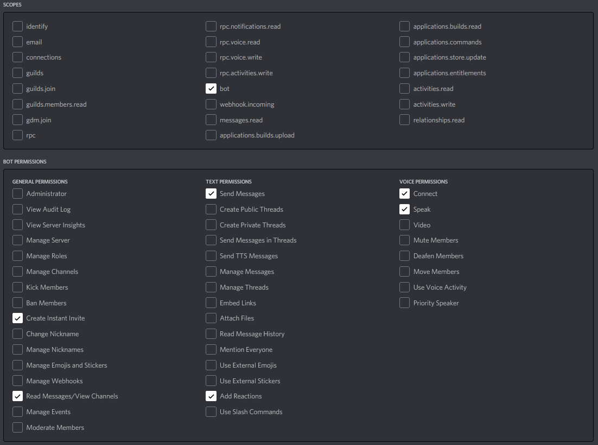
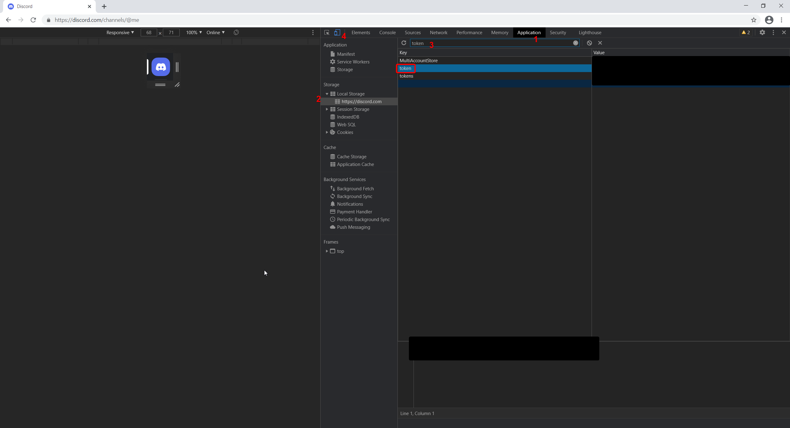
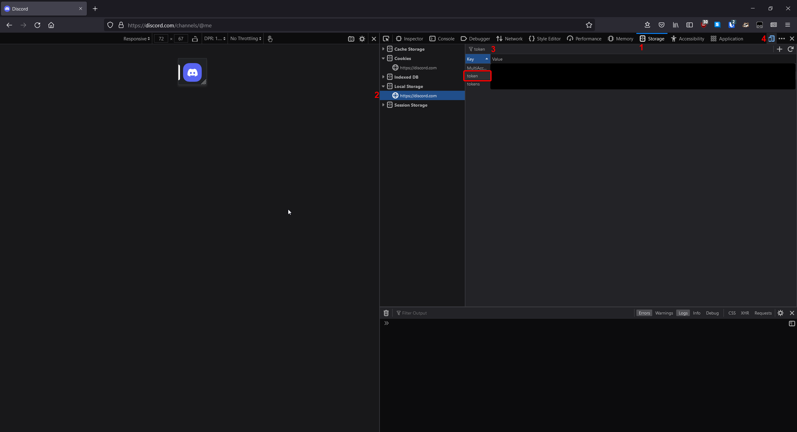

# Discord-Stream-Recorder
A bot that can record discord streams and screen shares. Sadly we can only record one stream at a time. Expect Bugs.

## What you need
- A discord bot account
   - https://discord.com/developers #account is made here
   - 
   - Bot token is found on the general information page, it is the bot public key
- A spare discord user account
- [Docker](https://docs.docker.com/get-docker/)

## Deployment
1. Add your tokens to `secrets/discord-tokens.json` (See below for a guide on how to get them)
1. Uncomment and edit volume paths in `docker-compose.yaml`. Recordings are saved in the `out` directory.
   ```This will be where you want the files to be saved. An easy solution is setting it to the filepath where you have stored this code.```
1. Invite your bot to your server by generating, then opening an OAuth url with these permissions:
   
1. Install [Docker](https://docs.docker.com/get-docker/).
1. Run `docker-compose up -d` inside this repository.
1. Type `!help` in your discord server for a list of available commands.


## Getting your tokens
### Bot Account
**DO NOT SHARE THS TOKEN WITH ANYONE!**
1. Create a new App at [https://discord.com/developers](https://discord.com/developers)
1. Create a new Bot
1. Click `Copy Token`

### User Account
Go to [https://discord.com/](https://discord.com/) and login to your account. Follow the additional instructions based on your browser.

#### Chrome

**DO NOT SHARE THS TOKEN WITH ANYONE!**
0. Open the developer tools: `Chrome Menu (the three dots top right) > More Tools > Developer Tools`
1. Navigate to the `Application` tab
2. On the left, expand `Local Storage` and select `https://discord.com`
3. Type `token` into the filter
4. Toggle `Device Toolbar` (click the button on the top left that looks like a phone and tablet)
5. Your token should appear as shown


#### Firefox

**DO NOT SHARE THS TOKEN WITH ANYONE!**
0. Open the developer tools: `Firefox Menu (the three bars top right) > More Tools > Web Developer Tools`
1. Navigate to the `Storage` tab
2. On the left, expand `Local Storage` and select `https://discord.com`
3. Type `token` into the filter
4. Toggle `Responsive Design Mode` (click the button on the top right that looks like a phone and tablet)
5. Your token should appear as shown

